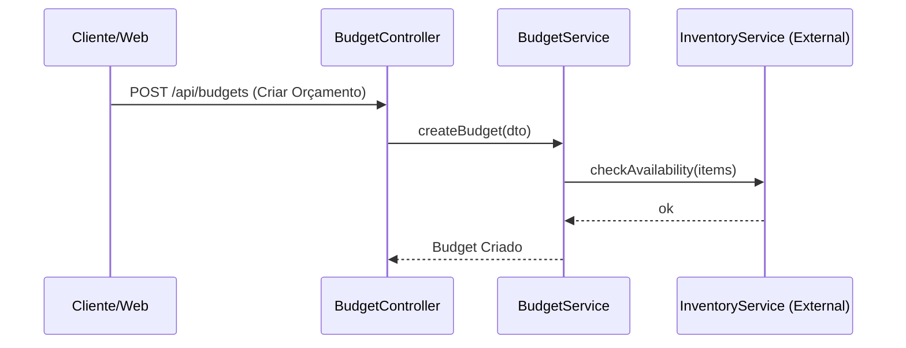

# Módulo: [Nome do Módulo] (Ex: Orçamentos / Budgets)

## 🎯 Objetivo e Bounded Context (DDD)
[Descreva o que este módulo faz. Quais são as fronteiras dele? O que ele não faz? Ex: Este módulo gerencia o ciclo de vida dos orçamentos, mas não é responsável por gerenciar os clientes ou o pagamento.]

## 📦 Entidades Core e Agregados
- **[Entidade A]**: [Descrição do papel e invariantes da entidade. Ex: `Budget` - Representa o orçamento principal. Um orçamento nunca pode ser alterado se estiver com status APPROVED.]
- **[Entidade B]**: [Ex: `BudgetItem` - Faz parte do agregado de Budget.]

## 🔄 Fluxograma do Módulo (Mermaid)
[Substitua este código por um diagrama de sequência ou de estado que mostre como os dados fluem dentro do módulo.]

## ⚖️ Regras de Negócio Importantes
1. [Regra 1. Ex: Um orçamento necessita da aprovação do gerente se o desconto for maior que 10%.]
2. [Regra 2.]

## 📝 ADRs (Architecture Decision Records) - Decisões Técnicas
Mantenha um histórico das decisões técnicas exclusivas deste módulo para os próximos desenvolvedores ou IAs entenderem o *porquê* das coisas.

### [Data da Decisão] - [Título da Decisão. Ex: Uso de Event Emitter para Atualização de Estoque]
- **Contexto**: Quando um orçamento é aprovado, precisamos reservar o estoque, mas chamar o InventoryService diretamente criaria um acoplamento forte.
- **Decisão**: Optamos por usar o `@nestjs/event-emitter` para disparar um evento `budget.approved`, que o módulo de estoque escuta independentemente.
- **Consequências**: Melhor desacoplamento, mas exige cuidado extra no rastreamento de logs e tratamento de erros assíncronos.
