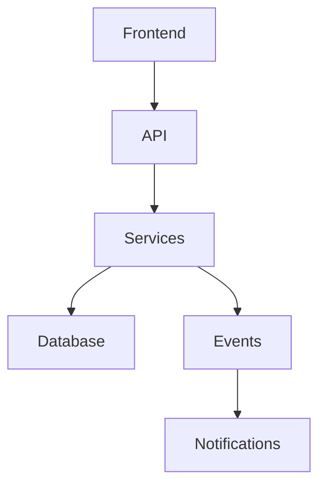

# Engenharia de Software Orientada por IA, Agentes e Arquitetura Viva

## Visão Geral

Este repositório nasceu da necessidade de estudar, estruturar e evoluir a utilização de agentes de IA no desenvolvimento de software moderno.

O objetivo não é apenas “gerar código com IA”.

A proposta é muito maior:

* Transformar IA em um sistema operacional de engenharia.
* Criar fluxos previsíveis para desenvolvimento assistido.
* Reduzir alucinações e decisões inconsistentes.
* Estruturar arquiteturas escaláveis e documentadas.
* Integrar IA com Clean Architecture, DDD, ADRs e documentação viva.
* Fazer com que a IA participe do ciclo completo de engenharia:

  * análise,
  * arquitetura,
  * implementação,
  * revisão,
  * documentação,
  * refatoração,
  * governança técnica.

---

# O Problema da IA no Desenvolvimento

LLMs como:

* OpenAI
* Google
* Anthropic

são modelos probabilísticos.

Isso significa que:

* elas tentam prever a resposta mais provável,
* e não necessariamente a resposta mais correta arquiteturalmente.

Esse comportamento é excelente para:

* texto,
* criatividade,
* brainstorming,
* automação simples.

Mas é perigoso em engenharia de software complexa.

## Exemplo real do problema

Você pede:

> “Crie um módulo de faturamento.”

Uma IA sem contexto normalmente:

* cria backend e frontend simultaneamente,
* mistura responsabilidades,
* ignora modelagem de dados,
* acopla regras de negócio em controllers,
* gera código sem estratégia de testes,
* replica padrões inconsistentes,
* ignora arquitetura existente.

Resultado:

* código difícil de manter,
* documentação inexistente,
* baixa previsibilidade,
* dívida técnica acelerada.

---

# A Ideia Central deste Repositório

A proposta aqui é criar uma “gaiola de contenção positiva” para agentes de IA.

Ou seja:

A IA continua poderosa, mas trabalha dentro de:

* regras,
* fluxos,
* contratos,
* arquitetura,
* padrões técnicos,
* documentação obrigatória,
* revisões automáticas.

---

# O Conceito de Engenharia Guiada por Agentes

Aqui a IA deixa de ser apenas:

> “um autocomplete inteligente”.

E passa a atuar como:

* arquiteta auxiliar,
* revisora técnica,
* documentadora,
* organizadora de contexto,
* mantenedora de arquitetura,
* agente operacional do fluxo de engenharia.

---

# O Protocolo V.L.A.E.G.

O VLAEG é um modelo operacional criado para impedir que agentes pulem etapas críticas do desenvolvimento.

## Objetivo

Garantir:

* previsibilidade,
* ordem arquitetural,
* contexto,
* rastreabilidade,
* qualidade técnica.

---

# Por que o VLAEG é importante?

Porque IA tende a:

* acelerar demais,
* assumir contexto,
* improvisar arquitetura,
* criar atalhos perigosos.

O VLAEG funciona como um workflow obrigatório.

---

# O Fluxo Conceitual

## V — Visão

A IA precisa entender:

* domínio,
* entidades,
* relacionamentos,
* arquitetura existente,
* impacto sistêmico.

Antes de escrever qualquer código.

---

## L — Lógica

Definição:

* regras de negócio,
* validações,
* fluxos,
* contratos,
* responsabilidades.

---

## A — Arquitetura

Separação obrigatória:

* camadas,
* bounded contexts,
* responsabilidades,
* isolamento de domínio.

Aqui entram conceitos como:

* Domain-Driven Design
* Clean Architecture
* SOLID
* arquitetura modular
* desacoplamento

---

## E — Estilo

Padronização:

* frontend,
* componentes,
* UX,
* consistência visual,
* convenções de código,
* naming.

---

## G — Governança

A etapa mais negligenciada em projetos com IA.

Inclui:

* documentação,
* ADRs,
* fluxogramas,
* revisão técnica,
* atualização de contexto,
* rastreabilidade de decisões.

---

# Dados Primeiro — Uma das Regras Mais Importantes

Um dos maiores problemas da IA é criar lógica antes de estruturar corretamente os dados.

Neste modelo:

* banco de dados vem primeiro.

Exemplo:

Antes de gerar:

* Services,
* Controllers,
* APIs,
* telas,

a IA precisa validar:

* entidades,
* relacionamentos,
* schema,
* consistência do domínio.

---

# Exemplo Prático

## Solicitação

> “Precisamos criar o módulo de comissão de técnicos.”

## Fluxo tradicional da IA

Uma IA comum:

* cria endpoints,
* cria componentes React,
* inventa tabelas,
* mistura regras de negócio.

---

## Fluxo com VLAEG

### Etapa 1 — Visão

A IA analisa:

* Técnicos
* Ordens de serviço
* Pagamentos
* Comissão
* Fechamento mensal

### Etapa 2 — Dados

A IA propõe:

* alteração no schema,
* relacionamentos,
* impacto em queries.

### Etapa 3 — Backend

Implementação isolada:

* Services,
* DTOs,
* regras,
* testes.

### Etapa 4 — Frontend

Somente após backend estabilizado.

### Etapa 5 — Governança

Atualização automática:

* documentação,
* ADR,
* diagramas,
* contexto do módulo.

---

# Clean Architecture + IA

IA naturalmente tenta:

* acoplar,
* centralizar lógica,
* resolver rápido.

Por isso o repositório estuda formas de impor regras rígidas como:

## Backend

* Nunca usar `any`
* Controllers apenas recebem/repassam
* Regra de negócio somente em Services
* DTOs obrigatórios
* Validação explícita
* Separação de domínio

---

## Frontend

* Componentização consistente
* Server Components por padrão
* UI reutilizável
* Padronização visual
* Nada de interfaces genéricas

---

# Revisão Pós-Feature

Uma ideia extremamente poderosa.

A feature não termina quando “funciona”.

A IA é obrigada a revisar o próprio código.

Ela precisa perguntar:

* isso está acoplado?
* está testável?
* há repetição?
* existe violação de arquitetura?
* posso melhorar separação de responsabilidades?

Isso cria:

* mini code reviews automáticos,
* refatoração contínua,
* evolução arquitetural incremental.

---

# Documentação Viva

Um dos maiores problemas de software:

* documentação desatualizada.

Aqui a proposta é:

Toda feature nova:

* atualiza contexto,
* atualiza documentação do módulo,
* atualiza diagramas,
* registra decisões.

---

# Estrutura Modular de Documentação

Exemplo:

```txt
.ai/
 ├── vlaeg/
 ├── modules/
 │    ├── orcamentos.md
 │    ├── financeiro.md
 │    ├── usuarios.md
 │    └── estoque.md
 └── architecture.md
```

Cada módulo contém:

* regras de negócio,
* fluxos,
* endpoints,
* decisões técnicas,
* diagramas,
* contexto operacional.

---

# ADR — Architecture Decision Records

Um dos conceitos mais importantes deste estudo.

## O que é um ADR?

É o registro do:

> “por que tomamos determinada decisão técnica”.

Não apenas:

> “o que foi feito”.

---

## Exemplo

### Decisão

Uso de eventos para atualização de estoque.

### Motivo

Evitar acoplamento entre:

* orçamento,
* estoque,
* faturamento.

---

## Benefícios

Meses depois:

* novos devs entendem o motivo,
* evita retrabalho,
* reduz discussões repetidas,
* preserva conhecimento arquitetural.

---

# Mermaid.js e Diagramas Vivos

Diagramas tradicionais envelhecem rápido.

Ferramentas externas normalmente:

* ficam desatualizadas,
* dependem de manutenção manual.

Com Mermaid:

* diagramas são texto,
* versionáveis,
* atualizáveis pela IA,
* renderizados diretamente no GitHub.

---

# Exemplo Conceitual



---

# Escalabilidade de Agentes

Outro ponto central deste repositório.

No futuro podemos ter:

* um agente especializado em frontend,
* outro em banco,
* outro em testes,
* outro em documentação,
* outro em arquitetura.

Os arquivos:

* `GEMINI.md`
* `.ai/index.md`
* módulos
* ADRs

funcionam como:

> contratos operacionais entre agentes.

---

# Benefícios Reais Dessa Abordagem

## Redução de Alucinações

Quanto mais contexto:

* menos improviso,
* menos inconsistência,
* menos decisões aleatórias.

---

## Arquitetura Mais Consistente

A IA segue:

* padrões,
* contratos,
* fluxos.

---

## Onboarding Mais Rápido

Novos desenvolvedores:

* entendem módulos rapidamente,
* leem contexto estruturado,
* não precisam explorar milhares de linhas inicialmente.

---

## Documentação Sempre Atualizada

Porque atualizar documentação vira parte obrigatória do fluxo.

---

## Refatoração Contínua

A IA revisa:

* acoplamento,
* responsabilidades,
* padrões.

---

## Escalabilidade Organizacional

A arquitetura deixa de depender:

* da memória do time,
* do “dev que sabe tudo”.

---

# Objetivo Final Deste Repositório

Este repositório busca estudar como transformar IA em:

* infraestrutura de engenharia,
* sistema operacional de desenvolvimento,
* agente arquitetural,
* mantenedor de contexto,
* organizador técnico,
* colaborador sistêmico.

A ideia é sair do:

> “gerar código rapidamente”

para:

> “construir software sustentável com auxílio de agentes inteligentes”.

---

# Tecnologias e Conceitos Estudados

## Backend

* NestJS
* Prisma
* APIs REST
* GraphQL
* Microserviços
* Eventos

---

## Frontend

* Next.js
* React
* TailwindCSS
* Server Components

---

## Arquitetura

* DDD
* Clean Architecture
* SOLID
* ADR
* Event-Driven Architecture

---

## IA e Agentes

* Engenharia de Contexto
* Multiagentes
* Prompt Engineering
* Workflows determinísticos
* Governança de IA
* Arquitetura orientada por agentes

